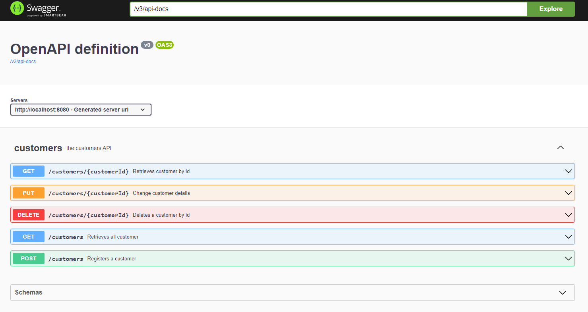

# Spring-Boot - Ports-And-Adapters / Hexagonal Architecture with DDD


## Overview
An example of a Spring-Boot application, which based on the port and adapters/hexagonal architecture and DDD.

|Build Status|License|
|------------|-------|
|[](https://github.com/hirannor/springboot-hexagonal-ddd/actions/workflows/maven.yml)|[](https://opensource.org/licenses/MIT)|

## Prerequisites for development

- [Git](https://git-scm.com/downloads)
- [JDK 17](https://adoptium.net/)
- [Maven](https://maven.apache.org/download.cgi)
- [Docker Desktop](https://www.docker.com/products/docker-desktop/)

## Implementing a new adapter

In the application the whole component scan for the adapter package is excluded, so the unnecessary adapter beans won't be loaded into the application context, just the configured ones.
Each adapter defines her own spring configuration class, which is imported via the **@Import** annotation (on top of the application's main class) but only those get component scanned where the condition(s) fulfills for it via **@ConditionalOnProperty** annotation.

Based on the below example if you define "spring-data-jpa" value as a persistence adapter in the application-[profile].yml, 
then it will activate the corresponding Configuration class, which is going to component scan the underlying packages for spring beans.

### Example

```java
@Configuration
@EnableJpaRepositories
@ComponentScan
@ConditionalOnProperty(
        value = "adapter.persistence",
        havingValue = "spring-data-jpa"
)
public class JpaPersistenceConfiguration {

}
```

application-[profile].yml
```YAML
adapter:
  authentication: basic
  persistence: spring-data-jpa
  messaging: spring-event-bus
  web: rest
```

## Build and test with Maven
```
mvn clean verify
```

**Building and verifying the application requires a running docker, since some tests are using
Testcontainers library!


### Test catalog and Maven lifecycle bindings

| Test catalog type | Maven lifecycle |
|:-----------------:|:---------------:|
|     Unit test     |      test       |
|  Component test   |      test       |
|   ArchUnit test   |      test       |
| Integration test  |     verify      |
|  Functional test  |     verify      |

## API Documentation
You can access the API documentation locally at the following URL:

[http://localhost:8080/swagger-ui/index.html](http://localhost:8080/swagger-ui/index.html)





